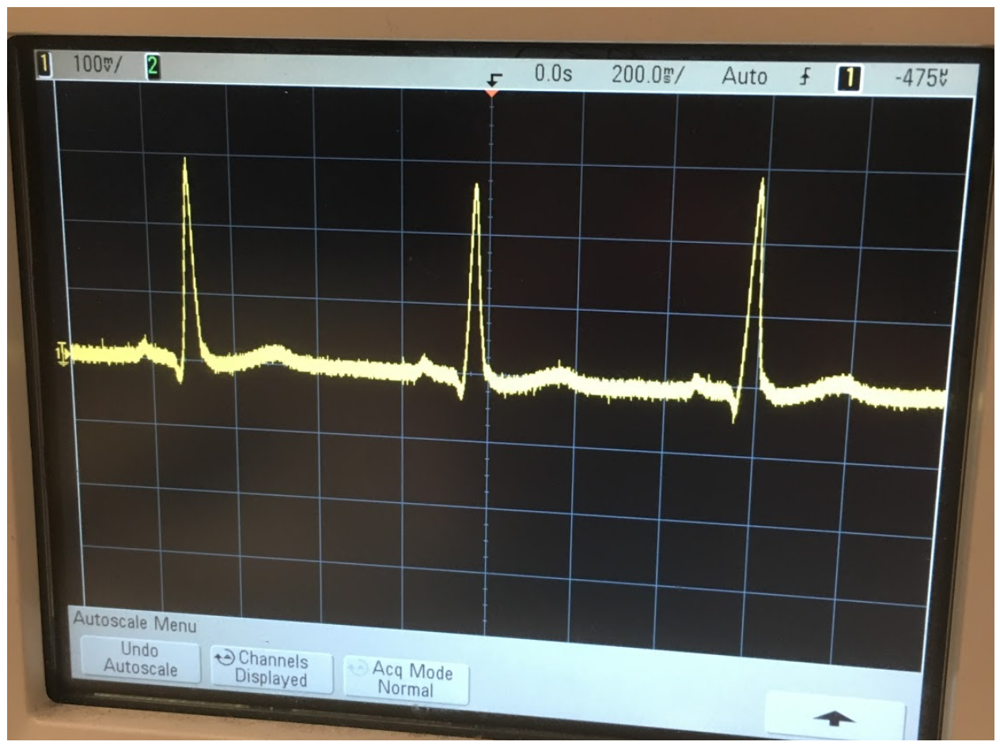

## Circuits and Signals Final Project

### Goal
Develop a set of analog and digital filters to mitigate noise in an ECG signal and detect a heartbeat in an ECG signal.

Credit goes to the Circuits and Signals teaching faculty of the Fall 2019 semester at Northeastern University, and my lab partner for the class.

### The Design
As commonly known, an ECG signal can be used to measure a person's heartbeat. In an ECG signal there is the QRS complex, which represents the timing of contractions in the left and right sides of the heart <a href="https://en.wikipedia.org/wiki/QRS_complex/"> (source)</a>. This QRS complex can be represented by a set of three peaks, as shown by the image below:

Caption: An ideal ECG signal that demonstrates the QRS complex in an ECG.

From that ideal ECG signal, it can be seen that a set of five peaks should be measurable and visible. From measuring an unfiltered ECG signal (shown below) we can see that there is a clear need to conduct filtering and amplification on the ECG signal; there is a high amount of noise.

The image below shows an unfiltered ECG signal that we obtained:

Caption: An unfiltered ECG signal that we obtained.

Common types of noise, especially with the instrumentation involved with ECG signals, include DC noise (zero frequency noise), interference noise (60Hz and its harmonics), and high frequency noise (as is common in a lot of electronics).

So my partner and I created an analog circuit that utilized an instrumentation amplifier (that applied an initial gain without increasing noise
and a bandpass filter (that mitigated DC and high frequency noise). The image below shows the circuit diagram we designed:

Caption: The analog circuit we designed. 

This image shows the above circuit implemented on a breadboard:

Caption: The above circuit diagram implemented on a breadboard.

Digitally we utilized a low pass filter to further mitigate high frequency noise and a set of notch filters to remove interference noise at 60Hz and its harmonics. The digital filtering was conducted in MATLAB.

Caption: A screenshot showing the MATLAB code we wrote for digital filtering.

This code is also on my <a href = "https://github.com/gajjara/CircuitsAndSignalsFinal/">github</a>.

### The Result
After analog filtering its clear that we were able to obtain a more coherent ECG signal, however, the analog filtering does show that further filtering is needed; which will be conducted digitally.

Caption: The ECG signal obtained after analog filtering.

With digital filtering, we were also able to obtain a clearer signal. As in the frequency domain (from a Fourier transform) the digital low pass filter we implemented, we can see that high frequency noise is cutoff.

Caption: The ECG signal after being filtered through a low pass digital filter.

With the digital notch filters we implemented, it is clear that we were able to obtain a smooth ECG signal in the time domain, as shown by the image below:

Caption: The ECG signal after being filtered through a set of notch filters to remove interference noise.

After filtering, we were able to obtain a more coherent ECG signal, and we simply used a Fourier transform and identified the frequency with the highest intensity to identify the heartbeat.

With the ECG signal above, we were able to detect a heartbeat of 111 beats per minute; which is consistent with the ECG signal as in the sample of 10 seconds there are 17 beats (thus 102 beats per minute). 

Thus we were able to utilize analog and digital filtering techniques to detect a heartbeat from an ECG signal. 

Again credit goes to the teaching faculty for this course in Fall 2019, and my lab partner.
